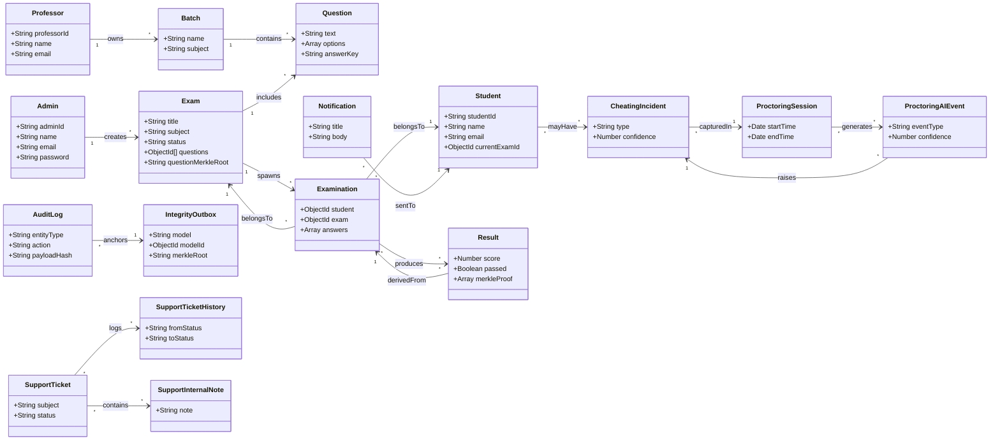

# ZeroLeak – Database Models Overview

> **Purpose**: This document describes every Mongoose model defined in `backend/src/models`.  It explains *why* each model exists, how it is structured, and how the models relate to one another.  The information is useful for developers learning the ZeroLeak architecture, onboarding new contributors, or extending the data layer.

---

## 📦 Model Catalogue
| Model | Primary Entity | Key Relationships | Main Use‑Case |
|------|----------------|-------------------|--------------|
| `admin.models.js` | Admin user (system administrator) | None (creates other entities) | Manages platform configuration, creates exams, audits. |
| `auditor.models.js` | Auditor (independent verifier) | Reads `AuditLog`, `Result` | Verifies integrity of exams via blockchain & Merkle proofs. |
| `student.models.js` | Student (exam taker) | References `Exam` (currentExamId) | Auth, session tracking, exam participation. |
| `professor.models.js` | Professor (exam creator) | Owns `Batch`, `Question` | Creates batches of questions, schedules exams. |
| `batch.models.js` | Batch of questions | References many `Question` | Groups questions for a specific exam or subject. |
| `question.models.js` | Individual question | Belongs to `Batch` | Stored in MongoDB; hash added to Merkle tree for audit. |
| `exam.models.js` | Exam definition | References `Question` array, `Examination`, `Admin` | Core exam configuration, scheduling, Zero‑Leak mode. |
| `examination.models.js` | Runtime exam session (per‑student) | Links `Student`, `Exam`, `Result` | Tracks student progress, timestamps, live telemetry. |
| `result.models.js` | Exam result | References `Student`, `Exam`, `Examination` | Stores marks, pass/fail, Merkle proof of answers. |
| `cheatingIncident.models.js` | Detected cheating event | Links `Student`, `Exam`, `ProctoringSession` | Captures anti‑cheating telemetry, AI analysis. |
| `proctoringSession.models.js` | Live proctoring session | References `Student`, `Exam` | Real‑time video/audio stream metadata, heartbeat. |
| `proctoringAIEvent.models.js` | AI‑generated proctoring event | Belongs to `ProctoringSession` | AI‑based gaze/face anomalies, confidence scores. |
| `proctoringIncident.models.js` | Human‑reviewed incident | References `ProctoringSession`, `CheatingIncident` | Stores reviewer notes, status, resolution. |
| `anomaly.models.js` | Generic anomaly (e.g., network lag) | May belong to `Student` or `Exam` | Used for analytics & alerting. |
| `auditlog.models.js` | Immutable audit log entry (blockchain) | References any entity via `entityId` | Records cryptographic commitments, timestamps. |
| `integrityOutbox.models.js` | Outbox for pending blockchain commits | Holds pending `MerkleRoot` entries | Worker reads and writes to Hyperledger Fabric. |
| `notification.models.js` | Push / in‑app notifications | Targets `Student`, `Professor`, `Admin` | Alerts about exam start, results, incidents. |
| `supportTicket.models.js` | Support ticket (user‑raised) | References `Student` or `Professor` | Handles help‑desk workflow, histories. |
| `supportTicketHistory.models.js` | History entries for a ticket | Belongs to `SupportTicket` | Immutable log of ticket updates. |
| `supportInternalNote.models.js` | Internal note (private) | Belongs to `SupportTicket` | Staff‑only commentary. |

---

## 🧩 Detailed Model Walk‑Through

### 1. `admin.models.js`
```js
import mongoose, { Schema } from 'mongoose';

const adminSchema = new Schema({
  adminId: { type: String, required: true, unique: true },
  name:   { type: String, required: true },
  email:  { type: String, required: true, unique: true },
  password: { type: String, required: true },
  role: { type: String, default: 'Admin' },
}, { timestamps: true });
```
*Why?* – Centralised privileged account that can create Exams, manage users, and trigger blockchain anchoring.
*How?* – No direct references; admins act as the `createdBy` field on `Exam` and as the owner of many audit‑log entries.

---

### 2. `student.models.js`
*(full source shown earlier)*
*Key points*
- **Password hashing** with Bcrypt in `pre('save')`.
- **JWT generation** for stateless auth (`generateAccessToken`).
- **Indexes** on `name`, `email`, `studentId` (text) and on `isBlocked` for quick admin queries.
- **Relation** – `currentExamId` points to an `Exam` document, enabling quick lookup of the exam a student is currently taking.

---

### 3. `exam.models.js`
*(source shown earlier)*
*Why?* – Stores exam metadata, scheduling, ZeroLeak‑specific config, and cryptographic commitments.
*How?*
- `questions` array of `ObjectId` → `Question`.
- `examinationId` links to a runtime `Examination` (one‑to‑many).
- `questionMerkleRoot`, `commitmentId`, `commitmentHash` hold values that are later anchored to Hyperledger Fabric.

---

### 4. `question.models.js`
```js
const questionSchema = new mongoose.Schema({
  text: { type: String, required: true },
  options: [{ label: String, value: String }],
  answerKey: { type: String, required: true },
  difficulty: { type: Number, enum: [1,2,3,4,5] },
  batch: { type: mongoose.Schema.Types.ObjectId, ref: 'Batch' },
  createdBy: { type: mongoose.Schema.Types.ObjectId, ref: 'Professor' },
}, { timestamps: true });
```
*Why?* – Central repository of question content. Each question is immutable after creation; any change creates a new version, preserving auditability.
*How?* – Belongs to a `Batch`. When an `Exam` is built, a *snapshot* of question IDs is stored and later hashed into a Merkle tree.

---

### 5. `batch.models.js`
```js
const batchSchema = new mongoose.Schema({
  name: { type: String, required: true },
  description: String,
  subject: { type: String, required: true },
  questions: [{ type: mongoose.Schema.Types.ObjectId, ref: 'Question' }],
  createdBy: { type: mongoose.Schema.Types.ObjectId, ref: 'Professor' },
}, { timestamps: true });
```
*Why?* – Allows professors to group questions (e.g., by topic) and reuse them across multiple exams.
*How?* – The `questions` array is used when constructing an `Exam` – the chosen subset is copied into the `Exam.questions` field.

---

### 6. `examination.models.js`
```js
const examinationSchema = new mongoose.Schema({
  student: { type: mongoose.Schema.Types.ObjectId, ref: 'Student', required: true },
  exam:    { type: mongoose.Schema.Types.ObjectId, ref: 'Exam', required: true },
  startedAt: { type: Date, default: Date.now },
  endedAt:   { type: Date },
  status: { type: String, enum: ['Running','Submitted','Aborted'], default: 'Running' },
  answers: [{ question: { type: mongoose.Schema.Types.ObjectId, ref: 'Question' },
             response: String,
             submittedAt: Date }],
}, { timestamps: true });
```
*Why?* – Captures the *live* session for a student. This document is what the front‑end writes to in real‑time (via Socket.io). It also stores a **snapshot of the question Merkle root** at start time for later verification.
*How?* – Links `Student` ↔ `Exam`. At end, a `Result` entry is derived from this document.

---

### 7. `result.models.js`
```js
const resultSchema = new mongoose.Schema({
  student: { type: mongoose.Schema.Types.ObjectId, ref: 'Student' },
  exam:    { type: mongoose.Schema.Types.ObjectId, ref: 'Exam' },
  examination: { type: mongoose.Schema.Types.ObjectId, ref: 'Examination' },
  score: Number,
  passed: Boolean,
  merkleProof: [{ type: String }], // proof elements for each answered question
  sealedAt: { type: Date, default: Date.now },
}, { timestamps: true });
```
*Why?* – Persists the final score and the cryptographic proof that the answers correspond to the original Merkle root.
*How?* – The `merkleProof` allows an auditor to verify that no answer was altered post‑submission.

---

### 8. `cheatingIncident.models.js`
```js
const cheatingIncidentSchema = new mongoose.Schema({
  student: { type: mongoose.Schema.Types.ObjectId, ref: 'Student' },
  exam:    { type: mongoose.Schema.Types.ObjectId, ref: 'Exam' },
  type: { type: String, enum: ['Audio','Video','Behavior','Network'] },
  confidence: Number, // AI confidence score (0‑100)
  evidencePath: String, // S3 or local path to video/audio snippet
  resolved: { type: Boolean, default: false },
}, { timestamps: true });
```
*Why?* – The anti‑cheating engine flags suspicious behavior (e.g., looking away, multiple faces). Each incident is stored for manual review.
*How?* – References `Student` and `Exam`. The `proctoringSession` that generated the event is stored in `ProctoringAIEvent`.

---

### 9. `proctoringSession.models.js`
```js
const sessionSchema = new mongoose.Schema({
  student: { type: mongoose.Schema.Types.ObjectId, ref: 'Student', required: true },
  exam:    { type: mongoose.Schema.Types.ObjectId, ref: 'Exam', required: true },
  startTime: Date,
  endTime:   Date,
  heartbeat: [{ timestamp: Date, latencyMs: Number }],
}, { timestamps: true });
```
*Why?* – Tracks the live video/audio stream life‑cycle and health metrics.
*How?* – Each `ProctoringAIEvent` belongs to a session; the session id is also stored in `CheatingIncident` for traceability.

---

### 10. `proctoringAIEvent.models.js`
```js
const aiEventSchema = new mongoose.Schema({
  session: { type: mongoose.Schema.Types.ObjectId, ref: 'ProctoringSession' },
  eventType: { type: String, enum: ['Gaze','Face','Audio'] },
  confidence: Number,
  timestamp: Date,
  metadata: mongoose.Schema.Types.Mixed,
}, { timestamps: true });
```
*Why?* – Holds AI‑generated detections (e.g., gaze drift > 30°) used to create a `CheatingIncident` if confidence exceeds a threshold.
*How?* – Direct reference to its parent `ProctoringSession`.

---

### 11. `proctoringIncident.models.js`
```js
const incidentSchema = new mongoose.Schema({
  aiEvent: { type: mongoose.Schema.Types.ObjectId, ref: 'ProctoringAIEvent' },
  reviewer: { type: mongoose.Schema.Types.ObjectId, ref: 'Admin' },
  decision: { type: String, enum: ['Confirmed','Dismissed','Pending'] },
  notes: String,
}, { timestamps: true });
```
*Why?* – Allows a human reviewer (admin) to validate or dismiss AI‑raised alerts.
*How?* – Connects AI event to the final decision record.

---

### 12. `auditlog.models.js`
```js
const auditLogSchema = new Schema({
  entityId: { type: mongoose.Schema.Types.ObjectId, required: true },
  entityType: { type: String, required: true },
  action: { type: String, enum: ['Create','Update','Delete','Anchor'] },
  payloadHash: { type: String }, // SHA‑256 of the JSON payload
  blockchainTxId: { type: String }, // Hyperledger Fabric transaction ID
}, { timestamps: true });
```
*Why?* – Provides an immutable trail that can be verified against the blockchain.
*How?* – Whenever a critical document (e.g., `Exam` or `Result`) is created/updated, a log entry is written and later anchored.

---

### 13. `integrityOutbox.models.js`
```js
const outboxSchema = new Schema({
  model: { type: String, required: true }, // e.g., 'Exam', 'Result'
  modelId: { type: mongoose.Schema.Types.ObjectId, required: true },
  merkleRoot: String,
  status: { type: String, enum: ['Pending','Sent','Failed'], default: 'Pending' },
}, { timestamps: true });
```
*Why?* – Acts as a staging area for items waiting to be anchored on the blockchain. A background worker polls this collection, creates the transaction, and updates `status`.
*How?* – Once `status` becomes `Sent`, the corresponding `AuditLog` entry receives a `blockchainTxId`.

---

### 14. `notification.models.js`
```js
const notificationSchema = new Schema({
  recipient: { type: mongoose.Schema.Types.ObjectId, required: true, refPath: 'recipientModel' },
  recipientModel: { type: String, enum: ['Student','Professor','Admin'] },
  title: String,
  body: String,
  read: { type: Boolean, default: false },
  link: String,
}, { timestamps: true });
```
*Why?* – In‑app alerts for exam start, result release, or incident updates.
*How?* – When a `Result` is released, a notification is created for each participating student.

---

### 15. `supportTicket.models.js`
```js
const ticketSchema = new Schema({
  raisedBy: { type: mongoose.Schema.Types.ObjectId, required: true, refPath: 'raisedByModel' },
  raisedByModel: { type: String, enum: ['Student','Professor'] },
  subject: String,
  status: { type: String, enum: ['Open','InProgress','Resolved','Closed'], default: 'Open' },
}, { timestamps: true });
```
*Why?* – Allows users to ask for help (e.g., technical issues, exam queries). Integrated with the internal note system.

---

### 16. `supportTicketHistory.models.js`
```js
const historySchema = new Schema({
  ticket: { type: mongoose.Schema.Types.ObjectId, ref: 'SupportTicket', required: true },
  changedBy: { type: mongoose.Schema.Types.ObjectId, refPath: 'changedByModel' },
  changedByModel: { type: String, enum: ['Student','Professor','Admin'] },
  fromStatus: String,
  toStatus: String,
  comment: String,
}, { timestamps: true });
```
*Why?* – Immutable change log for each ticket, useful for audit and SLA tracking.

---

### 17. `supportInternalNote.models.js`
```js
const noteSchema = new Schema({
  ticket: { type: mongoose.Schema.Types.ObjectId, ref: 'SupportTicket' },
  author: { type: mongoose.Schema.Types.ObjectId, ref: 'Admin' },
  note: String,
}, { timestamps: true });
```
*Why?* – Private staff notes not visible to the ticket raiser.

---

### 18. `anomaly.models.js`
```js
const anomalySchema = new Schema({
  entityId: { type: mongoose.Schema.Types.ObjectId }, // could be Student, Exam, etc.
  entityType: String,
  type: { type: String, enum: ['Network','Latency','Device'] },
  details: mongoose.Schema.Types.Mixed,
}, { timestamps: true });
```
*Why?* – Captures non‑cheating irregularities that are still valuable for analytics (e.g., high latency causing auto‑submission).

---

## 🖼️ Entity‑Relationship Diagram

*Explanation*: The diagram visualises primary entities and their cardinalities.  Arrows indicate ownership or generation relationships.

---

## 📚 How to Explore the Models
1. **Open a model file** – e.g., `backend/src/models/student.models.js`.
2. **Locate the schema definition** – Usually a `new Schema({ … })` block.
3. **Read the indexes** – They are defined after the schema and improve query performance.
4. **Check `pre`/`methods` hooks** – Business logic such as password hashing or JWT generation lives here.
5. **Reference other models** – Fields with `ref: 'ModelName'` create the relationships shown above.

---

## ✅ Quick Recap
- The backend stores **20 distinct Mongoose models** covering users, exams, questions, results, anti‑cheating, audit‑logging, notifications, and support tickets.
- **Zero‑Trust** is enforced via cryptographic commitments (`questionMerkleRoot`, `commitmentHash`) that are anchored to **Hyperledger Fabric** using the `IntegrityOutbox` and `AuditLog` pipelines.
- Real‑time proctoring and AI detection are modeled with `ProctoringSession`, `ProctoringAIEvent`, and `CheatingIncident`.
- All models are **indexed** for high‑throughput workloads typical of large‑scale examinations.

Feel free to ask for deeper dives into any particular model, the blockchain anchoring flow, or the AI‑driven proctoring pipeline!
